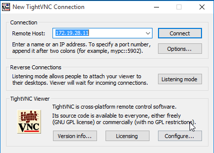
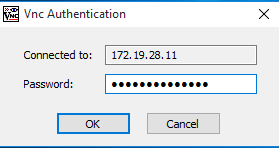
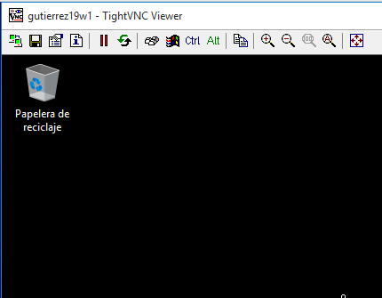
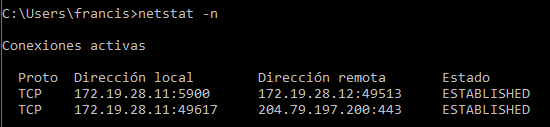

# VNC
## Conectar desde Windows Master hacia el Windows Slave.

## Conectar desde GNU/Linux Master hacia el Windows Slave.

## Ir al servidor VNC y usar el comando netstat -n para ver las conexiones VNC con el cliente.

